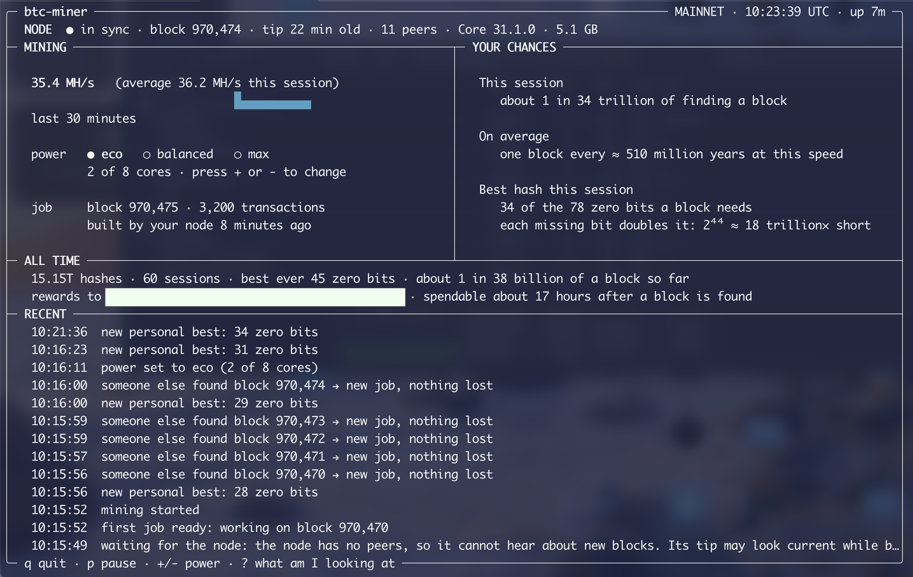

# btc-miner

*Formerly `mac-solo-miner`. Old links redirect here.*

Solo-mine **Bitcoin** on your Mac with one command. No Bitcoin experience
needed: it sets up everything it depends on, asks only about what's missing, and
then shows a single live screen.

Everything Bitcoin-specific — SHA-256, the block header, block assembly, the
pool protocol, the mining loop — is written from scratch in Rust, so the whole
path from a block template to a valid block can be read and checked. Its
sibling, [bip110-miner](https://github.com/saeedet/bip110-miner), does the same
for the BIP-110 fork.

> **Honest version up front.** This is a lottery ticket with astronomical odds.
> An M3 Mac on all eight cores would expect to find a block about once every
> **180 million years**. There is no partial credit and no slow drip of
> earnings. Run it because it's interesting to watch your own computer take part
> in Bitcoin, not to earn.



*The live dashboard, mining Bitcoin mainnet on an 8-core M3 Mac. The reward address is hidden.*

## What you need

- A Mac with Apple Silicon (M1 or later), on macOS.
- [Homebrew](https://brew.sh).
- About **27 GB** of free disk on mainnet.
- An internet connection. The first sync downloads on the order of 100 GB,
  though the node keeps only the most recent 5 GB of blocks.

## Install

With [Homebrew](https://brew.sh):

```bash
brew install saeedet/tap/btc-miner
```

Bitcoin Core comes with it, so there is nothing else to install.

### From source

Building it yourself needs [Rust](https://rustup.rs):

```bash
git clone https://github.com/saeedet/btc-miner.git
cd btc-miner
cargo install --locked --path crates/cli
```

That puts `btc-miner` in `~/.cargo/bin`.

## First run

```bash
btc-miner
```

It checks four things, and asks about any that aren't ready:

1. **This computer** — the chip, and whether the disk has room.
2. **Node software** — the node is the program that talks to the Bitcoin
   network and checks every block itself. It's called Bitcoin Core. If it's
   missing or too old, setup offers to install or upgrade it with Homebrew.
3. **Reward address** — where a reward goes if you find a block. Paste an
   address from any Bitcoin wallet you already use (the node checks it first),
   or let setup create a wallet on your node, protected by a passphrase.
4. **Blockchain** — your node needs its own copy. A quick start loads a
   snapshot (about 10 GB, checked by the node itself) and gets you mining in
   hours instead of days. Mining starts on its own as soon as it's caught up.

Next time, with everything in place, it goes straight to the dashboard.

## Everyday use

| Command | What it does |
|---|---|
| `btc-miner` | Set up anything missing, then mine |
| `btc-miner setup` | Go through setup again — this is how you change where rewards go |
| `btc-miner status` | Where the node and the chain are |
| `btc-miner wallet` | Your reward address, and whether this node can spend it |
| `btc-miner doctor` | Check everything mining depends on, with fixes for anything wrong |
| `btc-miner stop` | Shut the node down |

While mining:

| Key | Does |
|---|---|
| `q` | Quit. The node keeps running, so the next start is instant |
| `p` | Pause or resume |
| `+` `-` | Power: eco, balanced or max. Remembered for next time |
| `?` | Explain what's on screen |

Useful options: `--power eco|balanced|max`, `--threads N`, `--allow-sleep` (by
default the Mac is kept awake while mining), and `--plain` for a log instead of
the dashboard. When the output isn't a terminal — a log file, a service — it
prints the log automatically. `--network testnet4` or `--network regtest` mines a
test network instead.

Stopping costs nothing. Every hash is a fresh lottery ticket, so an hour today
and an hour next month are worth exactly what two hours now would be.

## Where things live

| Path | What |
|---|---|
| `~/.btc-miner/config.toml` | Your choices: network, power, reward address |
| `~/.btc-miner/lifetime.json` | Hashes and best results across every session |
| `~/.bitcoin-solo` | The node's data: the blockchain, and any wallet on it |
| `~/btc-rewards.backup` | A backup of the wallet setup created, if it made one. Keep a copy elsewhere |

`~/.bitcoin-solo` is deliberately not Bitcoin Core's default folder, so nothing
this program does can touch another node or wallet on the same Mac.

## Uninstall

```bash
btc-miner stop
brew uninstall btc-miner
```

(or `cargo uninstall btc-miner` if you built it from source)

Then delete `~/.btc-miner`, and `~/.bitcoin-solo` for the blockchain — **after
backing up and moving any wallet in it that holds coins**. `brew uninstall
bitcoin` removes Bitcoin Core too, if nothing else uses it.

## Learn more

- [docs/architecture.md](docs/architecture.md) — how the code fits together,
  how fast it hashes, and how to read the lifetime figures
- [docs/cli-design.md](docs/cli-design.md) — the screens, as designed

[Contributing](CONTRIBUTING.md) · [Security](SECURITY.md) ·
[Changelog](CHANGELOG.md) · [MIT License](LICENSE)
